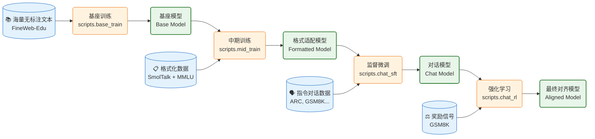
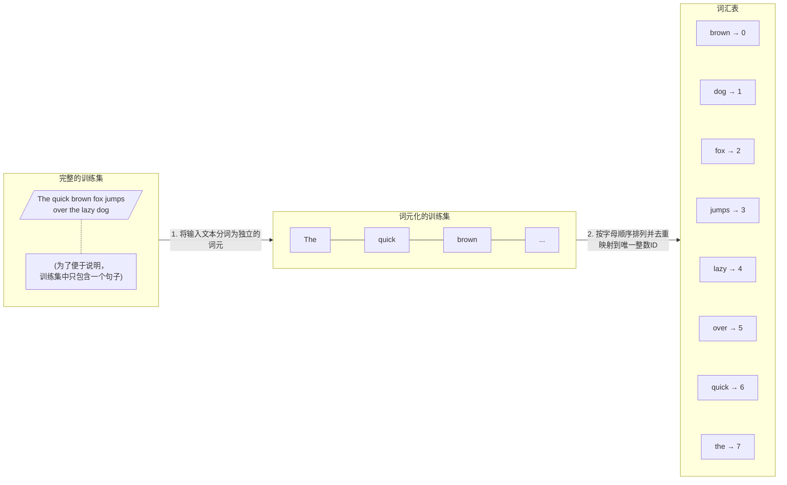

* TOC
{:toc}

## 一：项目背景

### 1.1 为什么要自己构建大语言模型？

OpenAI 推出的 ChatGPT 等大语言模型作为深度神经网络模型的代表，为自然语言处理（NLP）领域带来了革命性的变化。大语言模型在理解、生成和解释人类语言方面拥有出色的能力。
从零开始构建大语言模型不仅是一次深入了解模型机制和局限性的绝佳机会，还为我们提供了预训练和微调开源大语言模型，使其适应特定领域的数据集或任务的必要知识。
Andrej Karpathy 最近开源了 [nanochat](https://github.com/karpathy/nanochat) 项目，号称花 100 美元就能从零训出一个能聊天的模型。正好手边有台 DGX Spark，于是决定跑一遍完整流程，顺便记录下来。

### 1.2 nanochat 项目介绍

nanochat 是一个全栈式的大语言模型实现，旨在用最简洁、最少依赖的代码库复刻 ChatGPT 的核心功能。它不仅涵盖了从分词（Tokenization）、预训练（Pre-training）、微调（Fine-tuning）到推理（Inference）和 Web 服务部署的完整生命周期，还特别强调代码的可读性和可修改性（Hackable）。
现代大语言模型的构建通常分为**预训练（Pre-training）** 和 **后训练（Post-training）** 两个主要阶段。
* **预训练阶段**：这是消耗算力最大的阶段，旨在让模型从海量无标注文本中学习通用知识，产出**基座模型（Base Model）**。
* **后训练阶段**：旨在将基座模型转化为能与人交互的助手。在 nanochat 项目中，这一阶段被细分为三个具体步骤：
    * **中期训练（Mid-training）**：让模型适应对话格式和工具使用。值得注意的是，在更广泛的业界实践中，这一阶段通常也被称为「继续预训练」（Continued Pre-training）或「增量预训练」（Incremental Pre-training）。
    * **监督微调（SFT）**：通过问答数据教会模型遵循指令。
    * **强化学习（RL）**：进一步优化模型的回答质量（如数学推理能力）。

为了帮助大家理清这四个阶段（基座训练 + 后训练三部曲）的递进关系，我整理了下面这张全景对照表，涵盖了从脚本入口到真实数据集的完整细节：

| 核心阶段 (Stage)               | 具体步骤 (Step)                 | nanochat 对应脚本        | 核心目标 (Goal)                            | 输入数据 (Input)                                                          | 数据集 (Dataset)                                                                                                                                                                                                                                                                                                                                                                                                                     | 输出模型 (Output)                                                | 关键特征 (Key Features)                                           | 训练耗时 (DGX Spark) |
|:---------------------------|:----------------------------|:---------------------|:---------------------------------------|:----------------------------------------------------------------------|:----------------------------------------------------------------------------------------------------------------------------------------------------------------------------------------------------------------------------------------------------------------------------------------------------------------------------------------------------------------------------------------------------------------------------------|:-------------------------------------------------------------|:--------------------------------------------------------------|:-----------------|
| **预训练**<br>(Pre-training)  | **基座训练**<br>(Base Training) | `scripts.base_train` | **知识获取**：学习通用语言规律、世界知识和逻辑推理能力。         | **海量无标注文本**<br>(Raw Text)<br><i>来源：网页、书籍、代码库</i>                      | **[FineWeb-Edu](https://huggingface.co/datasets/karpathy/fineweb-edu-100b-shuffle) (100B Shuffle)**<br>~112 亿 Token（540 亿字符）                                                                                                                                                                                                                                                                                                       | **基座模型**<br>(Base Model)<br><i>能力：擅长文本续写，但不懂指令交互</i>         | 算力消耗最大 (约占 99%)<br>核心任务：Next Token Prediction                 | ~10 天            |
| **后训练**<br>(Post-training) | **中期训练**<br>(Mid-training)  | `scripts.mid_train`  | **格式适应**：教会模型识别特殊 Token、工具调用 JSON 格式等。 | **特定格式/合成数据**<br>(Synthetic/Formatted Data)<br><i>来源：身份设定、工具调用示例</i>  | **[SmolTalk](https://huggingface.co/datasets/HuggingFaceTB/smol-smoltalk) (460K) + [MMLU auxiliary_train](https://huggingface.co/datasets/cais/mmlu) (100K，来自 ARC、MC_TEST、OBQA、RACE) + GSM8K (8K) + Spelling (280K) + Identity (1K×2)**<br>混合数据 (~850K 样本)                                                                                                                                                                                                                  | **格式适配模型**<br><i>能力：熟悉对话结构，但对话内容质量尚待提升</i>                   | 介于预训练和 SFT 之间的过渡<br>nanochat 特有步骤 (类比 Continued Pre-training) | ~9 小时            |
|                            | **监督微调**<br>(SFT)           | `scripts.chat_sft`   | **指令遵循**：教会模型如何像助手一样对话，理解用户意图并正确回应。    | **指令-回复对**<br>(Instruction-Response Pairs)<br><i>来源：高质量人工撰写或筛选的问答</i> | **[ARC](https://huggingface.co/datasets/allenai/ai2_arc) (Easy/Challenge), [GSM8K](https://huggingface.co/datasets/openai/gsm8k) (Main), [SmolTalk](https://huggingface.co/datasets/HuggingFaceTB/smol-smoltalk) (10k subset), [Identity](https://karpathy-public.s3.us-west-2.amazonaws.com/identity_conversations.jsonl) (Synthetic), [English Words](https://github.com/dwyl/english-words) (SpellingBee)**<br>精选指令集 (~23K 样本) | **对话/指令模型**<br>(Chat/Instruct Model)<br><i>能力：能流畅对话，遵循指令</i> | 模仿学习 (Supervised Learning)<br>让模型「学会说话」                       | ~1 小时            |
|                            | **强化学习**<br>(RL)            | `scripts.chat_rl`    | **偏好对齐**：进一步优化回答质量，提升特定能力（如数学逻辑）或安全性。  | **提示词 + 奖励信号**<br>(Prompts + Rewards)<br><i>来源：GSM8K 数学题、人类偏好排序</i>   | **[GSM8K](https://huggingface.co/datasets/openai/gsm8k) (Main)**<br>数学应用题 (~7.5K 问题)                                                                                                                                                                                                                                                                                                                                              | **对齐模型**<br>(Aligned Model)<br><i>能力：符合人类价值观，逻辑更严密</i>       | 探索与利用 (Exploration & Exploitation)<br>让模型「说得更好」               | ~6 小时            |

> **💡 关于安全对齐**：在业界完整的大模型训练流程中，**安全性和价值观对齐**主要在 **RL 阶段**通过 RLHF（Reinforcement Learning from Human Feedback）或 DPO（Direct Preference Optimization）等方法实现。人类标注员会对模型回复进行偏好排序，训练奖励模型来评估回答是否**有帮助（Helpful）**、**诚实（Honest）**、**无害（Harmless）**——即著名的 **3H 原则**。nanochat 作为教学项目，仅使用 GSM8K 数学题的正确性作为奖励信号，**并未实现完整的安全对齐**。

下图展示了 nanochat 完整的训练流水线，清晰地描绘了从海量文本到最终对齐模型的演进过程：



### 1.3 DGX Spark


上图为两位 AI 研究人员正在研究 DGX Spark 设备，其体积小巧，可轻松单手托持。

**NVIDIA DGX Spark** 是专为边缘计算和个人开发者设计的高性能 AI 工作站。它搭载了 **NVIDIA Grace Blackwell GB10** 芯片，拥有 **128 GB 统一内存架构（Unified Memory Architecture）**。

* **硬件优势**：传统的消费级显卡显存通常受限（如 24 GB），难以加载或训练较大的模型。而 DGX Spark 的 128 GB 统一内存打破了这一瓶颈。
* **新一代精度支持**：得益于 Blackwell 架构，DGX Spark 原生支持 **MXFP4**（Microscaling Format）和 **NVFP4** 等前沿数据类型。这些低精度格式在保持模型性能的同时，能显著降低显存占用并大幅提升计算吞吐量，为未来的优化预留了空间。值得一提的是，OpenAI 开源的 [gpt-oss](https://github.com/openai/gpt-oss) 项目正是采用 **MXFP4** 量化技术，使得 1170 亿参数的 `gpt-oss-120b` 模型能够在单张 80GB 显存的 GPU（如 NVIDIA H100 或 AMD MI300X）上运行推理，而 `gpt-oss-20b` 模型更是可以在 16GB 显存内运行。这充分展示了低精度量化技术在大模型部署中的巨大潜力。
* **美中不足**：虽然配备 128 GB 的统一内存，但不得不吐槽的是，它采用的是 LPDDR5X 统一内存，理论峰值带宽仅为 **273 GB/s**（数据来源：[NVIDIA 官方规格](https://www.nvidia.com/en-us/products/workstations/dgx-spark/)），相比数据中心级别 H100 的 HBM3 带宽（**3.35 TB/s**）有约 **12 倍**的差距。由于大语言模型训练是典型的内存带宽受限（Memory-Bound）任务，这意味着在 DGX Spark 上训练时，GPU 计算单元往往在「等待」数据从内存传输过来，导致训练时间显著延长（这也是为什么我们需要耐心等待约 10 天来完成预训练的原因）。


在 DGX Spark 运行 `nvidia-smi` 命令：搭载 NVIDIA GB10 芯片，驱动版本 580.95.05，CUDA 13.0。GPU 利用率为 96%，约 78 GB 内存正被 nanochat 训练进程占用。

## 二：实战演练

> **⚠️ 网络环境提示**：全程需要科学上网，以确保能够顺利访问境外相关资源。

### 2.1 DGX Spark 训练环境适配

nanochat 项目推荐使用 **8 张 NVIDIA H100/H200 GPU**（基于 **Hopper 架构**）来快速完成训练（约 4 小时）。而在 DGX Spark 上，我们使用的是单张 **Grace Blackwell GB10** 芯片（基于 **Blackwell 架构**）。

为了在 DGX Spark 上顺利跑通 nanochat 的全流程训练，我们在原基础之上进行了以下关键适配：

* **CUDA 13.0 环境适配**：
    * **调整原因**：DGX Spark 搭载的 Grace Blackwell GB10 芯片需要最新的 CUDA 13.0 支持才能发挥最佳性能。
    * **具体调整**：修改 `pyproject.toml`，将 PyTorch 版本升级至 `>=2.9.0`，并指定 `cu130` 源。同时引入了 `triton>=3.5.0`
      ，以支持 Blackwell 架构下的内核编译与优化。

* **内存管理优化**：
    * **调整原因**：虽然 128 GB 统一内存容量很大，但为了防止长时间训练中的显存碎片化导致 OOM（Out Of Memory）。
    * **具体调整**：在训练脚本中设置了 `PYTORCH_ALLOC_CONF=max_split_size_mb:512`，优化 PyTorch 的内存分配策略。同时，将预训练的 `device_batch_size` 调整为 **32**，在充分利用内存与保持稳定性之间寻找平衡点。

* **网络加速配置**：
    * **调整原因**：考虑到国内网络环境访问 PyPI 和 Hugging Face 可能受限或速度较慢。
    * **具体建议**：推荐配置 pip 使用清华大学镜像源 (`https://pypi.tuna.tsinghua.edu.cn/simple`)，以及使用 HF-Mirror (
      `https://hf-mirror.com`) 加速模型和数据集的下载。

环境配置脚本如下：

```bash
#!/bin/bash
if [ ! -f cuda-ubuntu2404.pin ]; then
    wget https://developer.download.nvidia.com/compute/cuda/repos/ubuntu2404/sbsa/cuda-ubuntu2404.pin
fi
sudo mv cuda-ubuntu2404.pin /etc/apt/preferences.d/cuda-repository-pin-600
if [ ! -f cuda-repo-ubuntu2404-13-0-local_13.0.2-580.95.05-1_arm64.deb ]; then
    wget https://developer.download.nvidia.com/compute/cuda/13.0.2/local_installers/cuda-repo-ubuntu2404-13-0-local_13.0.2-580.95.05-1_arm64.deb
fi
sudo dpkg -i cuda-repo-ubuntu2404-13-0-local_13.0.2-580.95.05-1_arm64.deb
sudo cp /var/cuda-repo-ubuntu2404-13-0-local/cuda-*-keyring.gpg /usr/share/keyrings/
sudo apt-get update
sudo apt-get -y install cuda-toolkit-13-0

echo 'export TRITON_PTXAS_PATH=/usr/local/cuda-13.0/bin/ptxas' >> ~/.bashrc
echo 'export CUDA_HOME=/usr/local/cuda-13.0' >> ~/.bashrc
echo 'export PATH=/usr/local/cuda-13.0/bin:$PATH' >> ~/.bashrc
echo 'export LD_LIBRARY_PATH=/usr/local/cuda-13.0/lib64:${LD_LIBRARY_PATH}' >> ~/.bashrc

echo 'export HF_ENDPOINT=https://hf-mirror.com' >> ~/.bashrc

source ~/.bashrc

# Verify installation
nvcc --version
nvidia-smi

git clone https://github.com/karpathy/nanochat.git
cd nanochat

sed -i 's/"torch>=2.8.0"/"torch>=2.9.0"/g' pyproject.toml
sed -i '/tiktoken>=0.11.0/a\    "triton>=3.5.0",' pyproject.toml
sed -i 's|pytorch-cu128|pytorch-cu130|g' pyproject.toml
sed -i 's|cu128|cu130|g' pyproject.toml
sed -i 's|# target torch to cuda 12.8 or CPU|# target torch to cuda 13.0 or CPU|' pyproject.toml


 # Use HF-Mirror to accelerate dataset download in China
 sed -i 's|https://huggingface.co|https://hf-mirror.com|g' nanochat/dataset.py

# install uv (if not already installed)
command -v uv &> /dev/null || curl -LsSf https://astral.sh/uv/install.sh | sh
# create a .venv local virtual environment (if it doesn't exist)
[ -d ".venv" ] || uv venv
# install the repo dependencies (using Tsinghua mirror for faster download in China)
uv sync --extra gpu --index-url https://pypi.tuna.tsinghua.edu.cn/simple
# activate venv so that `python` uses the project's venv instead of system python
source .venv/bin/activate
```

### 2.2 处理文本数据

在正式开始训练之前，我们需要先把海量文本转换成模型能理解的「数字语言」。这个过程就像给电脑准备一本「字典」，让它知道如何阅读人类的语言。

#### 2.2.1 词元与词元 ID

* **词元（Token）**：是模型理解和处理文本的最小单位。它不一定等同于一个单词，它可以是一个单词、一个汉字、一个词根，甚至是一个字符或字节。例如，单词「learning」可能被拆分为「learn」和「ing」两个词元。
* **词元 ID（Token ID）**：为了让计算机能够处理，每个唯一的词元都会被分配一个独一无二的数字编号，这就是词元 ID。模型实际上是在处理这些数字序列，而不是文本本身。

nanochat 采用了与 **GPT-4** 相同的 **BPE（Byte Pair Encoding）** 分词算法，但在细节上针对小模型进行了优化：

* **预分词（Pre-tokenization）**：首先使用正则表达式（Regex）将文本粗略地切分成一个个小块。nanochat 使用的正则模式 `SPLIT_PATTERN` 能够智能地处理缩写（如 `'ll`、`'ve`）、数字和标点符号。
    * *优化点*：nanochat 将数字的匹配规则从 GPT-4 的 `\p{N}{1,3}`（最多 3 位数字）调整为 `\p{N}{1,2}`（最多 2 位数字），这样可以减少数字类词元对词表空间的占用，更适合小参数量的模型。
* **字节级 BPE**：它不是直接处理 Unicode 字符，而是处理 UTF-8 编码后的字节。这意味着它可以处理任何语言的文本，甚至包括 emoji 表情，而不会出现「未知字符」错误。

将词元转换成词元 ID 的过程通常称为 **Encoding（编码）**：

* **查表**：分词器内部维护着一个巨大的**词表（Vocabulary）**，记录了所有已知的词元及其对应的 ID（nanochat 的词表大小为 65,536）。
* **映射**：当文本被切分成词元序列后，分词器会遍历这个序列，在词表中查找每个词元对应的 ID。
* **输出**：最终，一段文本就被转换成了一串数字列表（Tensor），这才是送入神经网络的真正「输入」。

例如：`"Hello world"` -> 分词 -> `["Hello", " world"]` -> 查表 -> `[15496, 995]`。



#### 2.2.2 词嵌入（Word Embeddings）

虽然词元 ID 解决了「将文本转换为数字」的问题，但这些数字本身是离散的，没有任何语义关联。例如，词元 ID `100`（apple）和 `101`（banana）在数值上只差 1，但计算机并不知道它们都是水果。

**词嵌入（Word Embeddings）** 就是为了解决这个问题。它将每个词元 ID 映射到一个高维的连续向量空间中（nanochat d20 配置下为 1280 维）。在这个空间里：

* **语义相似**的词（如「king」和「queen」）在距离上会靠得很近。
* **语义关系**可以通过向量运算来表示（经典的例子：$Vector(King) - Vector(Man) + Vector(Woman) \approx Vector(Queen)$）。

简单来说，词嵌入就是给每个词元赋予一个「特征列表」，让模型能够理解词与词之间的微妙关系。

在 `nanochat/gpt.py` 中，我们可以看到 nanochat 对词嵌入的处理有几个显著特点：

* **独立的嵌入层（`wte`）**：nanochat 使用一个标准的 `nn.Embedding` 层作为查找表，将 65,536 个词元（由 Tokenizer 训练决定）映射为高维向量（d20 配置下为 1280 维）。
  ```python
  self.transformer = nn.ModuleDict({
      "wte": nn.Embedding(config.vocab_size, config.n_embd),
      # ...
  })
  ```

* **解绑权重（Untied Weights）**：与许多早期模型（如 GPT-2）不同，nanochat 的输入嵌入层（`wte`）和输出层（`lm_head`）**不共享权重**。这意味着模型可以分别学习「如何理解输入」和「如何生成输出」，增加了模型的表达能力。

* **嵌入后归一化（Embedding Norm）**：nanochat 在嵌入层之后立即应用了 **RMSNorm**（Root Mean Square Normalization）。这是一种简化的归一化方法，它只对激活值进行方差归一化（除以均方根），而不像 LayerNorm 那样做零均值化，因此计算开销更小。这种现代化的设计有助于稳定训练过程，防止梯度爆炸，加速权重的有效收敛。
  ```python
  # Forward pass snippet
  x = self.transformer.wte(idx)
  x = norm(x) # 立即进行归一化
  ```

* **混合精度优化**：
  为了节省显存，nanochat 会将嵌入层的权重转换为 `bfloat16` 格式（如果硬件支持），这在保持精度的同时显著降低了内存占用。

* **差异化学习率**：
  在优化器设置中，nanochat 对嵌入层使用了 **AdamW** 优化器，并对其学习率进行了特殊缩放（$\propto 1/\sqrt{d_{model}}$
  ），而模型的主体部分（Linear 层）则使用 **Muon** 优化器。这种精细的调优策略确保了不同类型的参数都能以最佳速度收敛。

* **实现级别说明（Lookup → Norm → LM Head）**：
  为了让读者更直观地理解嵌入是如何被模型使用，下面给出一个简化的流程图（基于 `nanochat/gpt.py` 的前向逻辑）：

```mermaid
flowchart LR
  %% Data Nodes
  Input(Token IDs<br/>idx)
  Output(Logits<br/>Next Token Scores)

  %% Operation Nodes
  WTE[wte<br/>Embedding Lookup]
  Norm1[RMSNorm<br/>Post-Embedding]
  Trans[Transformer Blocks<br/>Attention + MLP]
  Norm2[RMSNorm<br/>Pre-LM Head]
  Head[lm_head<br/>Linear Projection]
  Softcap[Softcap<br/>Soft Capping]

  %% Flow
  Input -- "(B, T)" --> WTE
  WTE -- "(B, T, n_embd)" --> Norm1
  Norm1 --> Trans
  Trans -- "(B, T, n_embd)" --> Norm2
  Norm2 --> Head
  Head -- "(B, T, vocab_size)" --> Softcap
  Softcap --> Output

  %% Styling
  classDef data fill:#e3f2fd,stroke:#1565c0,stroke-width:2px;
  classDef op fill:#fff3e0,stroke:#ef6c00,stroke-width:2px,rx:5,ry:5;
      
  class Input,Output data;
  class WTE,Norm1,Norm2,Trans,Head,Softcap op;
```



关键点说明：
* 嵌入权重在初始化时采用正态分布（见 `_init_weights`），并在支持的设备上转换为 `bfloat16` 以节省内存。 
* `norm(x)` 在嵌入之后立即调用，有助于稳定后续 Transformer 层的训练。
* `lm_head` 为单独的线性层（不共享 `wte`），负责将模型的隐向量投射回词表维度，得到预测每个下一词的 logits。
* **Softcap** 是 nanochat 的一个特色设计：通过软截断将 logits 限制在 `[-15, 15]` 范围内：

  $$
  \text{logits}_{\text{capped}} = 15 \cdot \tanh\left(\frac{\text{logits}}{15}\right)
  $$

  这种软截断（Soft Capping）有助于防止 logits 数值过大导致的数值不稳定问题，同时保留了梯度信息（相比硬截断 clamp），是一种提升训练稳定性的技巧。

#### 2.2.3 下载预训练数据集

nanochat 采用 [FineWeb-Edu](https://huggingface.co/datasets/karpathy/fineweb-edu-100b-shuffle) 作为预训练数据集。该数据集由 Hugging Face 团队从 Common Crawl 中筛选出教育质量较高的网页内容，经过去重、过滤和质量评分后打包为 Parquet 格式。

**数据集规格**：

- **总规模**：1823 个 Parquet 文件，每个约 100 MB
- **预训练需求**：约 240 个文件（~24 GB），包含约 112 亿 Token
- **Tokenizer 训练需求**：前 8 个文件（~800 MB），包含约 20 亿字符

数据下载通过 `nanochat.dataset` 模块的 `download_single_file` 函数实现，支持断点续传和并行下载。下载后的文件存储在 `~/.cache/nanochat/base_data/` 目录。

#### 2.2.4 训练 BPE Tokenizer

Tokenizer 是将自然语言文本转换为模型可处理的整数序列的核心组件。nanochat 采用 **Byte Pair Encoding（BPE）** 算法，这是 GPT 系列模型的标准分词方案。

BPE 的实现相对复杂，nanochat 直接使用现有的 Python 开源库 tiktoken，它基于 Rust 的源代码非常高效地实现了 BPE 算法。BPE 算法的原理是将不在预定义词汇表中的单词分解为更小的子词单元甚至单个字符，从而能够处理词汇表之外的单词。

**训练流程**（`scripts/tok_train.py`）：

1. **预分词（Pre-tokenization）**：使用正则表达式 `SPLIT_PATTERN` 将文本切分为候选 Token。该模式针对小模型优化，将数字匹配规则从 GPT-4 的 `\p{N}{1,3}` 调整为 `\p{N}{1,2}`，减少数字类 Token 对词表空间的占用：
   ```
   r"""'(?i:[sdmt]|ll|ve|re)|[^\p{L}\p{N}]?+\p{L}+|\p{N}{1,2}| ?[^\s\p{L}\p{N}]++[\n]*|\s*[\n]|\s+(?!\S)|\s+"""
   ```

2. **字节级 BPE 训练**：基于 UTF-8 字节流进行训练，而非直接操作 Unicode 字符。这确保了对任意语言和特殊字符的无损处理。训练过程迭代合并高频字节对，直至词表达到目标大小 **65,536**（2^16），可用两字节表示任意 Token ID。

3. **特殊 Token 注册**：在基础词表之外追加 9 个特殊 Token（定义见 `tokenizer.py` 的 `SPECIAL_TOKENS`）：
   ```python
   ["<|bos|>", "<|user_start|>", "<|user_end|>", 
    "<|assistant_start|>", "<|assistant_end|>",
    "<|python_start|>", "<|python_end|>", 
    "<|output_start|>", "<|output_end|>"]
   ```
   这些 Token 用于标记文档边界、对话角色和工具调用，仅在后训练阶段启用。

4. **字节统计缓存**：为支持评估指标 Bits Per Byte（BPB），训练脚本会计算每个 Token 对应的 UTF-8 字节数并缓存到 `token_bytes.pt`。特殊 Token 的字节数设为 0，不参与压缩率计算。在模型评估时，该缓存用于将交叉熵损失转换为 BPB：`bpb = loss / ln(2) / avg_bytes_per_token`。

**实现细节**：nanochat 结合 `rustbpe`（训练）和 `tiktoken`（推理）两个库，前者用 Rust 实现高效训练，后者由 OpenAI 开源，提供优化的批量编码能力。

#### 2.2.5 评估 Tokenizer 压缩效率

训练完成后，通过 `scripts/tok_eval.py` 评估 Tokenizer 的压缩性能。核心指标为 **Bits Per Byte (BPB)**。

**Tokenizer 熵上界（均匀分布假设）**

假设每个 Token 以均匀概率出现（即不考虑语言模型的预测能力），则编码每个 Token 需要 $\log_2(V)$ 比特。在此假设下，Tokenizer 的压缩率上界公式为：

$$
\text{BPB}_{\text{upper bound}} = \frac{\log_2(V) \times N_{\text{tokens}}}{N_{\text{bytes}}} = \frac{16 \times N_{\text{tokens}}}{N_{\text{bytes}}}
$$

其中 $V = 65,536$ 为词表大小，$N_{\text{tokens}}$ 为 Token 数量，$N_{\text{bytes}}$ 为原始 UTF-8 字节数。这个指标衡量的是 **Tokenizer 本身的压缩效率上限**，与模型无关。实际的语言模型通过学习 Token 分布，能够以远低于此上界的比特数编码文本。

**实际 BPB（模型性能）**

在模型评估中，BPB 通常通过交叉熵损失计算，反映模型预测下一个 Token 的能力：

$$
\text{BPB}_{\text{model}} = \frac{\text{Cross Entropy Loss (nats)}}{\ln(2) \times \text{avg bytes per token}}
$$

这个指标综合了 Tokenizer 压缩率和模型预测准确性，是评估语言模型的重要指标。BPB 越低，表示模型对文本的建模能力越强。

**评估基准**:脚本在多种文本类型上测试 Tokenizer 的泛化能力:

- **新闻文本**（`news_text`）：英文政府公告
- **韩文文本**（`korean_text`）：非英语语言压缩测试
- **代码片段**（`code_text`）：Python 代码的符号密集文本
- **数学公式**（`math_text`）：LaTeX 格式的学术文档
- **科学文献**（`science_text`）：专业术语密集的生物化学文本
- **训练集/验证集样本**：从 FineWeb-Edu 采样的真实训练数据

评估结果还会与 GPT-2 和 GPT-4 的 Tokenizer 进行对比，输出每种文本类型的 Token 数量、压缩率（字节/Token）和相对差异百分比。

**性能指标参考**：

- 英文文本的 BPB 通常在 0.8-1.2 之间
- 压缩率（字节/Token）越高表示 Tokenizer 效率越好
- 对于 65,536 词表，$\log_2(65536) = 16$ bits/token 为理论上限

#### 2.2.6 实际操作流程

在 DGX Spark 上，我们可以通过以下脚本完成整个文本处理流程：

```bash
#!/bin/bash

# Install Rust / Cargo
curl --proto '=https' --tlsv1.2 -sSf https://sh.rustup.rs | sh -s -- -y
source "$HOME/.cargo/env"
# Build the rustbpe Tokenizer
uv run maturin develop --release --manifest-path rustbpe/Cargo.toml

# Download and prepare the dataset
python -m nanochat.dataset -n 240

# Train the tokenizer
python -m scripts.tok_train --max_chars=2000000000
python -m scripts.tok_eval

# Download evaluation bundle
curl -L -o eval_bundle.zip https://karpathy-public.s3.us-west-2.amazonaws.com/eval_bundle.zip
unzip -q eval_bundle.zip
rm eval_bundle.zip
mv eval_bundle "$HOME/.cache/nanochat"
```

这个脚本会自动完成：

1. ✅ 下载 240 个数据文件（其中 8 个用于训练 Tokenizer，这些文本文件还将用于后续的预训练）
2. ✅ 训练 Tokenizer 并保存到 `~/.cache/nanochat/tokenizer/`
3. ✅ 运行测试确保 Tokenizer 工作正常

**耗时估计**：首次运行约需 20-30 分钟（主要是下载时间）。

### 2.3 预训练（Pre-training）

预训练是构建大语言模型最核心、也是最消耗算力的阶段。在这个阶段，我们的目标是训练一个**基座模型（Base Model）**，让它学会「预测下一个词」（Next Token Prediction）。

#### 2.3.1 模型架构（Model Architecture）

nanochat 采用了一个现代化的 GPT 架构，融合了许多最新的研究成果以提升训练稳定性和推理效率：

* **Rotary Embeddings (RoPE)**：取代了传统的绝对位置编码，让模型更好地处理长文本。
* **QK Norm**：在 Attention 层对 Query 和 Key 进行归一化，显著提升了训练的稳定性。
* **ReLU² 激活函数**：在 MLP 层使用平方 ReLU，相比传统的 GeLU 计算更简单且效果相当。
* **无偏置设计 (No Bias)**：移除了所有线性层的偏置项，简化了模型结构。
* **RMSNorm**：使用均方根归一化，且不带可学习参数，进一步精简模型。
* **Group Query Attention (GQA) 支持**：支持使用更少的 Key/Value 头来减少推理时的内存占用和计算量（默认配置下 GQA 未启用，即 `n_kv_head = n_head`）。
* **零初始化 (Zero Init)**：对 `lm_head` 和每层的 `c_proj`（Attention 和 MLP 的输出投影）进行零初始化，有助于训练初期的稳定性。

#### 2.3.2 优化器创新（Optimization）

nanochat 引入了一种混合优化策略：

* **Muon 优化器**：用于优化模型中的 2D 矩阵参数（如 Linear 层的权重）。Muon 是一种基于动量的正交优化器，其核心思想是通过 **Newton-Schulz 迭代** 将梯度正交化后再更新参数，使得权重矩阵保持良好的条件数，从而加速收敛并提升训练稳定性。
* **AdamW 优化器**：用于优化 1D 向量参数（如 Embedding 和 Norm 层）。

这种组合（Muon + AdamW）旨在在保持收敛速度的同时，最大化训练的吞吐量。

#### 2.3.3 训练配置

在 DGX Spark 上，我们使用 `d20` 配置进行训练：

* **参数量**：约 0.56B
    * **含义**：参数量相当于模型的「脑细胞」数量，决定了其记忆知识和处理复杂逻辑的潜力。0.56B 参数属于轻量级模型，比较适合个人开发者入门学习。
    * **来源**：该数值是根据 `d20` 配置（即 20 层深度）动态推导出来的。具体来说，当深度设为 20 时，模型维度被自动设为 1280 (
      `20 * 64`)。累加所有权重参数后，总计约为 5.61 亿：
        * **Embedding 层 (wte)**: $65,536 \times 1,280 \approx 83.9 \text{M}$
        * **Transformer 层 (20层)**: $20 \times (12 \times 1,280^2) \approx 393.2 \text{M}$
            * 每层包含 **Attention** 和 **MLP** 两个子模块，参数量为 $12 \times d^2$，其中：
            
            | 组件 | 参数维度 | 参数量 |
            |------|----------|--------|
            | c_q (Query) | d × d | d² |
            | c_k (Key) | d × d | d² |
            | c_v (Value) | d × d | d² |
            | c_proj (Attention 输出) | d × d | d² |
            | c_fc (MLP 上投影) | d × 4d | 4d² |
            | c_proj (MLP 下投影) | 4d × d | 4d² |
            | **每层总计** | | **12d²** |
            
            > 注：上述计算假设 GQA 未启用（即 `n_kv_head = n_head`）。若启用 GQA，`c_k` 和 `c_v` 的参数量会按比例减少。
            
        * **LM Head 层**: $1,280 \times 65,536 \approx 83.9 \text{M}$
        * **总计**: $83.9 + 393.2 + 83.9 \approx 561 \text{M}$
* **层数 (Depth)**：20 层
    * **含义**：层数代表了神经网络的深度。每一层都是一个 Transformer 模块，数据经过层层加工，提取出从语法到语义的特征。20
      层是一个在性能和算力消耗之间取得平衡的经典设计。
* **上下文长度**：2048 Token
    * **含义**：上下文长度（Context Length）是模型的「短期记忆」窗口，决定了它一次能处理多少信息。2048 Token 大约相当于 1500 个英文单词或 1000 个汉字。
    * **来源**：该数值直接来源于训练脚本 `scripts/base_train.py` 中的配置 `max_seq_len = 2048`。这意味着如果对话或文章超过这个长度，模型就会「忘记」最早的内容。
* **总 Token 数**：约 112 亿 (遵循 Chinchilla Scaling Laws，Token 数约为参数量的 20 倍)

#### 2.3.4 启动训练

使用以下脚本启动预训练：

```bash
export PYTORCH_ALLOC_CONF=max_split_size_mb:512
export CUDA_LAUNCH_BLOCKING=0
export NPROC_PER_NODE=1
export WANDB_RUN="dummy"

python -m nanochat.report reset

# pretrain the d20 model
torchrun --standalone --nproc_per_node=$NPROC_PER_NODE -m scripts.base_train -- --depth=20 --run=$WANDB_RUN
# evaluate the model on a larger chunk of train/val data and draw some samples
torchrun --standalone --nproc_per_node=$NPROC_PER_NODE -m scripts.base_loss
# evaluate the model on CORE tasks
torchrun --standalone --nproc_per_node=$NPROC_PER_NODE -m scripts.base_eval
```

**训练过程监控**：

* 脚本会自动处理数据加载、模型初始化和梯度下降循环。
* 你可以通过终端输出看到实时的 Loss（损失值）和 MFU（模型算力利用率）。
    * **MFU（Model FLOPs Utilization）** 是衡量 GPU 计算效率的重要指标，表示实际计算速度占理论峰值的百分比。例如，H100 SXM 的 BF16 理论峰值为 989 TFLOPS。由于 DGX Spark 的内存带宽是瓶颈（273 GB/s vs H100 的 3.35 TB/s），其 MFU 会显著低于数据中心级 GPU。
* 训练完成后，模型权重将保存在 `~/.cache/nanochat/base_checkpoints/d20/` 目录下。

**耗时预警**：

由于 DGX Spark 只有单卡且显存带宽受限，完整训练这个 5.6 亿参数的模型大约需要 **10 天**。请确保电源连接稳定，并做好散热措施。此外，强烈建议使用 `screen` 工具来保持训练任务在后台运行，避免因 SSH 断连或终端关闭导致训练中断。

### 2.4 中期训练（Mid-training）

中期训练是 nanochat 项目中介于「预训练」和「监督微调」之间的过渡阶段。

**为什么需要中期训练？**基座模型虽然学会了说话，但它本质上还是一个「续写机器」，并不懂得对话的格式（比如什么时候该用户说，什么时候该助手说）。中期训练的目标就是让模型适应 **对话格式**和**特定任务**。

#### 2.4.1 数据混合策略（Data Mixture）

nanochat 在这个阶段使用了一个精心设计的混合数据集 `TaskMixture`，包含以下几类数据：

* **通用对话（SmolTalk）**：约 46 万条通用对话数据，让模型熟悉基本的问答模式。
* **学科知识（MMLU auxiliary_train）**：约 10 万条多项选择题，来自 `auxiliary_train` 子集（包含 ARC、MC_TEST、OBQA、RACE 等数据集），涵盖科学、人文等多个领域，强化模型的知识广度。注意：这并非标准的 MMLU 测试集，而是用于训练的辅助数据集。
* **数学与工具（GSM8K）**：约 8000 条数学应用题，教会模型逐步推理（Chain of Thought）和使用计算器工具。nanochat 实现了一个简单的计算器工具调用机制：
    * 模型生成 `<|python_start|>` 标记开始一个计算表达式
    * 表达式结束后生成 `<|python_end|>` 标记
    * 推理引擎（Engine）拦截这个表达式，调用 Python `eval()` 计算结果
    * 计算结果被**强制注入**到生成序列中，用 `<|output_start|>` 和 `<|output_end|>` 包裹
    * 模型继续生成后续内容，利用计算结果完成推理
* **拼写任务（Spelling）**：
    * **SimpleSpelling**：20 万条简单拼写练习（如「请拼出单词 'apple'」）
    * **SpellingBee**：8 万条字母计数任务（如「strawberry 中有几个 r？」）
    * 这两类数据共约 **28 万条**，用于修正 Tokenizer 导致的字符级理解缺陷。
* **自我认知（Identity）**：约 1000 条合成数据，在训练中加载两次（相当于 2 个 epoch）= **2000 条**，专门用来告诉模型「我是 nanochat，由 Andrej Karpathy 开发」，赋予模型独特的身份设定。

**总计：约 85 万样本**（460K + 100K + 8K + 200K + 80K + 2K ≈ 850K）

#### 2.4.2 训练逻辑

* **加载基座**：从预训练好的基座模型开始。
* **格式渲染**：将上述数据渲染成包含 `<|user_start|>`、`<|assistant_start|>` 等特殊 Token 的对话格式。
* **混合采样**：按比例从不同数据集中采样，确保模型在学习新能力的同时不遗忘通用知识。

#### 2.4.3 启动训练

使用以下脚本启动中期训练：

```bash
#!/bin/bash

# Download identity conversations file if it doesn't exist
if [ ! -f "$HOME/.cache/nanochat/identity_conversations.jsonl" ]; then
    echo "Downloading identity conversations dataset..."
    mkdir -p "$HOME/.cache/nanochat"
    curl -L -o "$HOME/.cache/nanochat/identity_conversations.jsonl" https://karpathy-public.s3.us-west-2.amazonaws.com/identity_conversations.jsonl
fi


torchrun --standalone --nproc_per_node=$NPROC_PER_NODE -m scripts.mid_train -- --run=$WANDB_RUN
torchrun --standalone --nproc_per_node=$NPROC_PER_NODE -m scripts.chat_eval -- -i mid
```

**耗时估计**：
相比预训练，中期训练的数据量小得多，在 DGX Spark 上大约需要 **9 小时** 即可完成。

训练完成后，你会得到一个既懂知识，又懂规矩（对话格式）的"格式适配模型"。

### 2.5 监督微调（SFT）

监督微调（Supervised Fine-Tuning）是让模型从「续写机器」变成「聊天助手」的关键一步。简单说就是：拿一堆高质量的问答对，手把手教模型怎么好好说话。

#### 2.5.1 精选数据集（Curated Dataset）

与前两个阶段追求数据量不同，SFT 阶段更看重数据的**质量**。nanochat 使用了一个约 2.3 万条样本的精选数据集：

* **ARC (Easy/Challenge)**：约 3400 条科学问答题，训练模型的逻辑推理能力。
* **GSM8K**：约 8000 条数学题，继续强化数学解题能力。
* **SmolTalk (精选)**：约 10000 条高质量对话，覆盖日常闲聊、建议咨询等场景。
* **Identity**：约 1000 条身份认知数据，反复强化「我是 nanochat」的自我意识。
* **Spelling**：共 600 条拼写任务数据（SimpleSpelling 300 条 + SpellingBee 300 条），保持对字符细节的敏感度。

#### 2.5.2 训练策略

* **Masked Loss**：在计算损失时，只计算模型**回复部分**的 Loss，而忽略用户提问部分的 Loss。这意味着模型只学习「如何回答」，而不学习「如何提问」。
* **小批量、多轮次**：由于数据量较小，我们通常会训练多个 Epoch（轮次），让模型充分吸收这些高质量指令。
* **低学习率**：相比预训练，SFT 阶段的学习率设置为预训练的 **2%**（`init_lr_frac=0.02`），以避免破坏模型已有的通用知识。值得注意的是，Mid-training 阶段使用的是 **100%** 学习率（`init_lr_frac=1.0`），因为它更接近预训练的延续。

#### 2.5.3 启动训练

使用以下脚本启动 SFT：

```bash
torchrun --standalone --nproc_per_node=$NPROC_PER_NODE -m scripts.chat_sft -- --run=$WANDB_RUN
torchrun --standalone --nproc_per_node=$NPROC_PER_NODE -m scripts.chat_eval -- -i sft
```

**耗时估计**：
这是最快的一个阶段，在 DGX Spark 上仅需约 **1 小时**。

训练完成后，你的模型就已经具备了 ChatGPT 的雏形，可以流畅地与你进行多轮对话了！

### 2.6 强化学习（RL）

强化学习（Reinforcement Learning）是让模型从「合格」迈向「优秀」的关键一步。在 nanochat 中，我们使用 RL 专门来提升模型的**数学解题能力**。

#### 2.6.1 算法选择：简化版 REINFORCE with Group Baseline

nanochat 的 RL 实现最初受到 GRPO（Group Relative Policy Optimization）的启发，但经过一系列简化后，最终变成了一种更接近 **REINFORCE with Group Baseline** 的算法。正如代码注释中所述：

> "I put GRPO in quotes because we actually end up with something a lot simpler and more similar to just REINFORCE."

相比传统的 PPO (Proximal Policy Optimization)，这种简化版算法更加高效且易于实现：

* **无需 Critic 模型**：传统 PPO 需要训练一个额外的 Critic 模型来评估状态价值，而 GRPO 直接使用一组采样结果的平均值作为基准（Baseline）。
* **组内相对优势**：对于同一个问题，模型生成 $N$ 个不同的回答。如果某个回答的得分高于这组回答的平均分，就鼓励模型多生成这样的回答；反之则抑制。
* **去繁就简**：nanochat 对 GRPO 进行了进一步简化：
    * **删除信任域约束**：没有 KL 散度正则化来约束与参考模型的距离。
    * **无需 PPO 裁剪**：因为是 On-Policy 训练（每次用最新模型采样），不需要 PPO 的 ratio+clip 机制。
    * **Token 级归一化**：采用 GAPO 风格的 Token 级归一化，而非传统的序列级归一化。
    * **简化优势函数**：使用 $(r - \mu)$ 作为优势值，而非标准的 z-score 归一化 $(r - \mu) / \sigma$。
  
  最终实现更接近于带有组内基准的 **REINFORCE** 算法，但保留了 GRPO 的核心思想——**通过对比来学习**。

#### 2.6.2 训练流程

1. **采样（Rollout）**：对于 GSM8K 中的每一道数学题，让模型生成 16 个不同的解题步骤（Temperature=1.0）。
2. **打分（Reward）**：检查这 16 个答案是否正确。答对得 1 分，答错得 0 分。
3. **优势计算（Advantage）**：计算这 16 个得分的平均值 $\mu$。每个样本的优势 $A = r - \mu$。
    * 例如：如果平均分是 0.2（大部分都错了），而某个样本答对了（得 1 分），那么它的优势就是 $1 - 0.2 = 0.8$（大大的正向激励）。
4. **策略更新（Update）**：根据优势值调整模型参数，增加高分回答出现的概率。

#### 2.6.3 启动训练

使用以下脚本启动 RL 训练：

```bash
# run reinforcement learning
torchrun --standalone --nproc_per_node=$NPROC_PER_NODE -m scripts.chat_rl -- --run=$WANDB_RUN
# eval the RL model only on GSM8K
torchrun --standalone --nproc_per_node=$NPROC_PER_NODE -m scripts.chat_eval -- -i rl -a GSM8K

# Generate the full report by putting together all the sections
# report.md is the output and will be copied to current directory for convenience
python -m nanochat.report generate
```

**耗时估计**：
在 DGX Spark 上，这个过程大约需要 **6 小时**。

经过这一步，你会发现模型在做数学题时，逻辑变得更加严密，解题正确率也会有显著提升。这是因为模型不仅学会了「怎么做」（SFT），还学会了「怎么做得更好」（RL）。

### 2.7 Web 聊天

跑了十天，总算能聊两句了。

nanochat 自带一个 Web 界面，启动之后直接在浏览器里就能对话。

#### 2.7.1 启动 Web 服务

```bash
MODEL_SOURCE=""
if [ -d "$HOME/.cache/nanochat/chatrl_checkpoints" ]; then
    MODEL_SOURCE="rl"
    echo "Found RL (Reinforcement Learning) checkpoints - using most advanced model"
elif [ -d "$HOME/.cache/nanochat/chatsft_checkpoints" ]; then
    MODEL_SOURCE="sft"
    echo "Found SFT (Supervised Fine-tuning) checkpoints"
elif [ -d "$HOME/.cache/nanochat/mid_checkpoints" ]; then
    MODEL_SOURCE="mid"
    echo "Found midtraining checkpoints"
elif [ -d "$HOME/.cache/nanochat/base_checkpoints" ]; then
    MODEL_SOURCE="base"
    echo "Found base pretraining checkpoints"
else
    echo "Error: No trained models found."
    exit 1
fi

# Launch the chat web interface with the appropriate model source
python -m scripts.chat_web --source "$MODEL_SOURCE"
```

启动成功后，终端会显示访问地址（`http://127.0.0.1:8000`）。在浏览器中打开这个地址，你就可以看到聊天界面了。


上图展示了 Web 服务器的启动日志：加载 d20 模型配置（20 层、1280 维、10 头注意力），从 RL 训练检查点加载权重，服务运行在 `http://0.0.0.0:8000`。


经过十天的漫长训练，我们终于得到了一个「有趣」的 AI 助手——它相信 1+1=1，认为李白是 AI 科学家，还成功让法国从世界地图上消失了。虽然在数学、历史、地理等方面存在明显的幻觉问题，但至少它已经具备了基本的对话能力和身份认知，并且对 Andrej Karpathy 国王保持着足够的尊重。

> **💡 为什么会出现这些「幻觉」？** 这些错误主要源于两个因素：（1）**参数量过小**——0.56B 参数的模型容量有限，难以准确记忆大量事实知识；（2）**训练数据分布偏差**——FineWeb-Edu 数据集以英文教育内容为主，对中文历史、地理等知识覆盖不足。根据 Scaling Laws，更大的模型（如 d32 配置的 1.9B 参数）通常能显著减少这类问题。

### 2.8 分享模型

最后，可以通过 huggingface_hub 库上传自己的模型并与社区共享。huggingface_hub 库的使用方法这里就不再赘述。

## 三：总结

前后大约折腾了两周时间，总算把整个流程跑通了：预训练（~10 天）+ 中期训练（~9 小时）+ SFT（~1 小时）+ RL（~6 小时）。果然预训练才是大头，剩下的加起来还不到一天。

这次用的是 `d20` 配置（5.6 亿参数），主要是怕 d32 跑太久。后续有计划继续尝试：

* **更深的模型架构（d32）**：nanochat 1000 美元的训练方案推荐使用 `--depth=32` 配置，可训练约 **19 亿参数**的模型。根据 Scaling Laws，更大的模型通常能带来更强的推理能力和更少的幻觉问题。在 8×H100 上，d32 配置的训练时间约为 **33 小时**。在单台 DGX Spark 上训练 d32 模型预计需要约 **80 天**（约为 d20 的 8 倍），而双 Spark 互联配置可将时间缩短至约 **40 天**。

* **低精度训练（MXFP4/NVFP4）**：DGX Spark 搭载的 Blackwell 架构原生支持 **MXFP4**（Microscaling Format）和 **NVFP4** 等前沿低精度数据类型。这些格式能够在几乎不损失模型性能的前提下，将显存占用降低至 FP16 的 **1/4**，并显著提升计算吞吐量。参考 OpenAI 开源的 gpt-oss 项目，MXFP4 量化使得 1170 亿参数的模型能在单张 80GB GPU 上运行推理。未来相关生态对 MXFP4 的支持会更加成熟，可以尝试在 DGX Spark 上进行 MXFP4 精度的训练，进一步释放 Blackwell 架构的潜力。

* **更长的上下文窗口**：当前模型的上下文长度为 2048 Token，对于长文档理解和多轮复杂对话存在限制。结合 RoPE 位置编码的外推能力，未来可以尝试扩展至 4096 甚至 8192 Token 的上下文长度。
