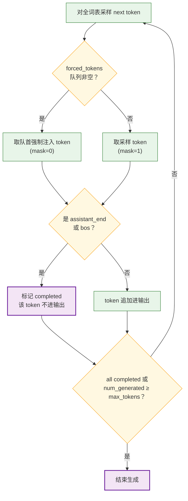

* TOC
{:toc}

## 一：一个悖论：预测机为什么不会永远预测下去

大语言模型的本质是一台**下一个 Token 预测机（Next Token Predictor）**：给定上下文，对整个词表输出一个概率分布，采样（或取最大）一个 Token，拼回上下文，再预测下一个。这个循环本身没有任何内在的终点——每一步的产出都是「下一个 Token」，于是问题来了：

**它凭什么有一天会输出「没有下一个 Token 了」？**

这个问题看似哲学，答案却出奇地工程化。我们先把结论放在这里，再逐层拆开：

> **「结束」本身就是词表里的一个普通 Token。停止不是模型的特殊能力，而是一次普通的 Token 预测；「真的停下来」这个动作，由外层的推理框架执行。**

以 nanochat 的词表为例，它有 65,536 个条目，其中 `hello`、`的`、` World` 这些常规 Token 之外，还混着一些看起来很特殊的字符串：`<|assistant_end|>`、`<|bos|>`……它们和普通 Token 一样，只是词表中的一个 ID。模型每一步对**全部** 65,536 个条目输出概率，当采样落到终止符上时，生成结束。

本文先建立一个「三层分工」的概念框架，然后逐行剖析 [nanochat](https://github.com/karpathy/nanochat)（我之前在 [《从零构建超迷你 ChatGPT》]({{ site.baseurl }}/2025/12/05/nanochat-training/) 中跑通过它的全流程训练）是怎么在每一层实现这套机制的——它没有抽象层，每一行代码都能对应到概念，是理解这个问题最好的教材。文中所有代码片段均逐字引自该仓库，引用处附有定位到具体行号的永久链接（permalink，锚定在笔者核对的 commit 上，不随上游更新漂移），点击即可跳转对照原文。

## 二：三层分工：模型、协议、运行时

在展开源码之前，先给出全文的分析框架。「LLM 如何停止」这个问题，实际上是三个层的协作：

| 层 | 职责 | 一句话概括 |
|:---|:---|:---|
| **模型层** | 学出 $P(\text{终止符} \mid \text{上下文})$ | 「停」是从数据里学出来的软概率，不是硬编码 |
| **协议层** | 定义哪个 Token 意味着「结束」 | 词表和 Chat 模板共同约定终止符的语义 |
| **运行时层** | 执行停止、剥除终止符、截断修补 | 推理引擎维护停止条件，模型只管预测 |

这个分工有一个直接推论：**模型在原理上没有任何机制保证它最终一定输出终止符**。EOS 只是概率分布里的一个竞争者，每一步它都要和「继续写下去」的所有 Token 抢概率质量。所以运行时层永远需要一个 `max_tokens` 兜底——这是保险，不是冗余。

下面用 nanochat 逐层验证这个框架。

## 三：nanochat 源码剖析

> **💡 代码引用说明**：本节所有代码片段均逐字引自 nanochat [仓库](https://github.com/karpathy/nanochat)的 commit `92d63d4`（与笔者本地跑训练的版本一致），每处引用附有带行号锚点的永久链接（permalink），不随上游更新漂移，可直接跳转对照上下文。

### 3.1 词表设计：一个没有 EOS 的词表

nanochat 在 [`nanochat/tokenizer.py`](https://github.com/karpathy/nanochat/blob/92d63d4/nanochat/tokenizer.py#L9-L21) 中定义了全部 9 个特殊 Token：

```python
SPECIAL_TOKENS = [
    "<|bos|>",           # 文档分隔符
    "<|user_start|>",    # 用户消息
    "<|user_end|>",
    "<|assistant_start|>",  # 助手消息
    "<|assistant_end|>",
    "<|python_start|>",  # 助手调用 Python REPL 工具
    "<|python_end|>",
    "<|output_start|>",  # Python REPL 输出回助手
    "<|output_end|>",
]
```

第一个值得注意的细节：**这个词表里没有 `<|eos|>`**。终止的角色由两个 Token 分担：

- `<|assistant_end|>`：对话轮次终止符，等价于 Llama 3 的 `<|eot_id|>`、Qwen 的 `<|im_end|>`；
- `<|bos|>`：文档分隔符，被采样到时同样终止生成。

`<|bos|>` 的双重身份是理解「EOS 本质」的钥匙。Karpathy 在 [`tokenizer.py` 的 `from_pretrained`](https://github.com/karpathy/nanochat/blob/92d63d4/nanochat/tokenizer.py#L70-L78) 里专门写了段注释解释这个历史上的命名混乱：

> tiktoken calls the special document delimiter token `<|endoftext|>`... yes this is confusing because this token is almost always **PREPENDED** to the beginning of the document... so in nanoChat we always use `<|bos|>` short for "beginning of sequence", but historically it is often called `<|endoftext|>`.

翻译过来：GPT-2 时代的文档分隔符叫 `<|endoftext|>`（「文本结束」），但它几乎总是被前插在文档**开头**当序列起点用。同一个 Token，既是「新文档的开始」，也是「旧文档的结束」——因为它就是**文档边界本身**。这个命名混乱之所以能存在，恰恰说明了 EOS 从来不是什么魔法：它只是一个在数据里出现位置有规律的普通 Token。

### 3.2 预训练：「停」是从数据打包方式里学来的

模型层的学习发生在预训练。nanochat 的数据加载器（[`nanochat/dataloader.py`](https://github.com/karpathy/nanochat/blob/92d63d4/nanochat/dataloader.py#L107)）在 tokenize 每篇 FineWeb-Edu 文档时前插 `<|bos|>`，然后用 Best-Fit 算法拼进定长训练序列。实际喂给模型的数据长这样：

```text
<bos> 文档1 <bos> 文档2 <bos> 文档3 <bos> 文档4 ...
```

关键在损失函数的构造方式：预训练的 targets 就是 inputs 右移一位，**所有位置都参与损失**（Best-Fit 打包保证 100% 利用率、无 padding）。这意味着「文档 3 写完之后，下一个 Token 是 `<|bos|>`」这件事本身就是被监督的预测目标：

$$\mathcal{L} = -\log P(t_{n+1} \mid x_{\le n}), \quad \text{其中 } t_{n+1} \text{ 经常是 } \texttt{<|bos|>}$$

跑过上百亿 Token 之后，基座模型就学会了 $P(\texttt{<|bos|>} \mid \text{「一篇文章自然收尾的上下文」})$ 显著升高。**模型会不会停，取决于你拼数据的方式**——这是「停止是学出来的」在数据工程上的落点。

一个佐证来自历史：没有对话训练的基座模型（GPT-3 时代）几乎不会好好停——要么无限写下去，要么在奇怪的地方断掉。当时只能靠停止字符串（比如匹配到 `"\n\nUser:"` 就截断）和 `max_tokens` 硬截断。终止符停得准，是后训练的产物，不是架构自带的。

### 3.3 SFT：把终止符明确构造为训练目标

预训练教会模型「文档有边界」，SFT 则把「一轮对话有边界」变成明确的监督信号。[`tokenizer.py` 的 `render_conversation`](https://github.com/karpathy/nanochat/blob/92d63d4/nanochat/tokenizer.py#L140-L224) 负责把对话渲染成 Token 序列，同时返回一个 mask——哪些位置是模型该学的（mask=1），哪些只是上下文（mask=0）：

```text
Token 序列:   <bos> <user_start> 用户问题 <user_end> <assistant_start> 模型回复 <assistant_end>
mask:          0      0            0        0           0                1             1
                                                                                          ↑
                                                                              终止符也被监督！
```

对应源码中的一行（[`tokenizer.py` L219](https://github.com/karpathy/nanochat/blob/92d63d4/nanochat/tokenizer.py#L219)）：

```python
add_tokens(assistant_end, 1)  # mask=1，参与损失
```

而 user 消息、`<|bos|>`、工具输出全部是 mask=0。随后 [`scripts/chat_sft.py`](https://github.com/karpathy/nanochat/blob/92d63d4/scripts/chat_sft.py#L285-L290) 把 mask=0 位置的 target 设为 -1（cross-entropy 的 `ignore_index`）：

```python
# Apply the loss mask from render_conversation (mask=1 for assistant completions,
# mask=0 for user prompts, BOS, special tokens, tool outputs). mask[1:] aligns
# with targets (shifted by 1). Unmasked positions get -1 (ignore_index).
mask_tensor = torch.tensor(mask_rows, dtype=torch.int8)
mask_targets = mask_tensor[:, 1:].to(device=device)
targets[mask_targets == 0] = -1
```

所以 SFT 的训练目标可以概括为一句话：**只在「给定对话前缀，生成助手回复 + 终止符」这些位置上更新参数**。终止符不是训练的附加品，它就是序列的最后一个监督目标——SFT 数据里每一条完整回复都以 `<|assistant_end|>` 收尾，$P(\text{终止符} \mid \text{「回答完了」})$ 就这样被对齐出来。

### 3.4 推理运行时：采样循环里的停止判断

[`nanochat/engine.py` 的 `generate` 方法`](https://github.com/karpathy/nanochat/blob/92d63d4/nanochat/engine.py#L176-L275)是「LLM 如何停」的最小完整实现，值得逐段走读。主循环每步先对全词表采样，然后做终止判断（[节选自 L185-L250](https://github.com/karpathy/nanochat/blob/92d63d4/nanochat/engine.py#L185-L250)）：

```python
# engine.py（节选，注释为原文）
assistant_end = get_special("<|assistant_end|>")  # if sampled, ends row
bos = self.tokenizer.get_bos_token_id()           # if sampled, ends row

while True:
    # Stop condition: we've reached max tokens
    if max_tokens is not None and num_generated >= max_tokens:
        break
    # Stop condition: all rows are completed
    if all(state.completed for state in row_states):
        break

    next_ids = sample_next_token(logits, rng, temperature, top_k)
    ...
    for i, state in enumerate(row_states):
        next_token = state.forced_tokens.popleft() if is_forced else sampled_tokens[i]
        # On <|assistant_end|> or <|bos|>, mark the row as completed
        if next_token == assistant_end or next_token == bos:
            state.completed = True
```

用流程图表示整个决策过程：



注意两道停止条件的分工：模型自己「想停」（采到终止符）是**软**条件，逐行独立生效；`max_tokens` 是**硬**条件，针对整个 batch。这正对应第二节说的「模型层的软概率 + 运行时层的硬规则」。

这里还有三个值得细品的工程细节：

**1. 已完成行的「僵尸生成」。** 批量采样时 KV cache 是整个 batch 一起算的，单行无法中途退出。某行采到终止符后，循环并不会跳过它——它继续接收 Token、继续过 forward，只是结果在 [`generate_batch`](https://github.com/karpathy/nanochat/blob/92d63d4/nanochat/engine.py#L277-L299) 里被 `if not completed[i]` 过滤掉。这是朴素实现的处理方式；生产级推理引擎（vLLM / SGLang 的 continuous batching）做的优化正是在单行完成后把它从 batch 里换出去、填入新请求，避免算力浪费在僵尸行上。

**2. 终止符由框架剥掉，不进输出。** `generate_batch` 里终止符只用来置 `completed` 标志，不 append 到结果序列——用户永远看不到 `<|assistant_end|>`，和真实 API 的行为一致。「终止符对用户不可见」是运行时层的职责，不是模型层的。

**3. 截断后的修补。** [`scripts/chat_cli.py`](https://github.com/karpathy/nanochat/blob/92d63d4/scripts/chat_cli.py#L92-L96) 里有段容易被忽略但很关键的逻辑：

```python
# we have to ensure that the assistant end token is the last token
# so even if generation ends due to max tokens, we have to append it to the end
if response_tokens[-1] != assistant_end:
    response_tokens.append(assistant_end)
conversation_tokens.extend(response_tokens)
```

如果生成是被 `max_tokens=256` 硬截断的（而不是自然终止的），CLI 会强行补一个 `<|assistant_end|>` 再拼回会话历史。否则下一轮的上下文里 assistant 消息没有闭合标记——这种结构模型在训练时从未见过，多轮对话立刻退化。**运行时必须维护协议的完整性，哪怕模型自己违反了协议。**

### 3.5 一个反直觉的点：Token 流不全是模型预测的

`engine.generate` 里还内置了一个 Python 计算器工具（GSM8K 数学题用的），它揭示了下一个常被忽略的事实：**真正的 Token 流是「模型采样」和「框架注入」的混合物**。

当模型采样出 `<|python_end|>` 时，框架解码出表达式、调用 REPL 计算，然后把 `<|output_start|>` + 计算结果 + `<|output_end|>` 通过 [`forced_tokens` 队列](https://github.com/karpathy/nanochat/blob/92d63d4/nanochat/engine.py#L237-L267)**强制注入** Token 流。以「123 乘 456 等于多少」为例，一轮回复的完整 Token 流是这样的：

```mermaid
flowchart LR
    P["assistant_start"] --- S1["好的，"] --- S2["让我算一下"] --- PS["python_start"] --- S3["123*456"] --- PE["python_end"] --- OS["output_start"] --- F["56088"] --- OE["output_end"] --- S4["所以答案是 56088"] --- AE["assistant_end"]

    classDef prompt fill:#ffebee,stroke:#c62828;
    classDef sampled fill:#e8f5e9,stroke:#2e7d32;
    classDef forced fill:#fff3e0,stroke:#ef6c00;
    classDef terminal fill:#f3e5f5,stroke:#6a1b9a,stroke-width:2px;

    class P prompt;
    class S1,S2,S3,S4 sampled;
    class PS,PE,OS,OE,F forced;
    class AE terminal;
```



其中绿色是模型采样出来的（SFT 时 mask=1），橙色是框架强制注入的（mask=0），紫色是终止符。这打破了「输出 = 一连串 next-token 预测」的朴素想象：终止判断和工具调用一样，都属于**框架对 Token 流的调度权**。

RL 阶段对这种混合的处理很严谨（[`scripts/chat_rl.py` L138-L139](https://github.com/karpathy/nanochat/blob/92d63d4/scripts/chat_rl.py#L138-L139)）：

```python
targets[mask_ids[:, 1:] == 0] = -1 # <-- inplace modification right here. -1 is the ignore index
# NOTE also that the Engine returns mask=0 for BOTH the prompt tokens AND the tool use tokens.
```

被注入的工具 Token 从 policy gradient 的 target 里挖掉，只对模型真正采样过的 Token 算梯度。另一个有趣的细节：RL batch 的 [padding 直接用 `assistant_end` 填充](https://github.com/karpathy/nanochat/blob/92d63d4/scripts/chat_rl.py#L87)（注释写明「只当 padding 用，不进损失」）——终止符在 RL 损失里几乎是隐形的，RL 对停止行为的影响是间接的：**答案没写完就停，GSM8K 的 reward 直接是 0；停得太晚则浪费采样预算**（`max_completion_tokens=256` 兜底）。真正让终止时机变得可靠的，是 SFT 阶段那一个 mask=1。

## 四：失败模式：为什么有时停不对

回到第二节埋下的伏笔：终止符只是概率分布里的一个竞争者。在每一步：

$$P(\text{继续}) = 1 - P(\text{终止符} \mid x_{\le n})$$

模型「想停」的意愿和「想写 the / 的」的意愿在同一个 softmax 里竞争。分布偏移、温度过高、陷入复读循环时，普通 Token 的概率可能持续压过终止符，于是要么停不下来，要么在半句话处戛然而止。这也是为什么温度设高之后模型更容易刹不住车——高温把分布抹平，终止符原本的概率优势被稀释。

实践中的三类兜底手段，对应三个不同的层：

| 现象 | 兜底手段 | 所属层 |
|:---|:---|:---|
| 永远停不下来 | `max_tokens` 硬截断 | 运行时层 |
| 停在奇怪的位置 | 停止字符串（如 `"\n\nUser:"`）匹配即截 | 运行时层 |
| 整体停得不准 | 更多/更好的 SFT 数据、RLHF 对「何时结束」给奖励 | 模型层 |

调试时有个实用技巧：很多推理框架可以输出每个 Token 的 logprobs，盯着终止符的概率看——一个健康的模型在接近答案结尾时，终止符概率会一路爬升，最后几个 Token 处占据压倒性优势；如果它始终在低概率区徘徊，说明停止行为没有被对齐好。

## 五：从 nanochat 到生产系统

nanochat 那个几十行的生成循环，在生产系统里被工程化成了同一套逻辑的放大版。以 vLLM / SGLang 为例，`SamplingParams` 暴露的停止相关参数和 `engine.generate` 的停止条件一一对应：

- **`stop_token_ids`**：终止 Token 列表（nanochat 里硬编码为 `assistant_end` + `bos` 两个）；还有一个 `ignore_eos` 参数，压力测试时用它强制模型不停，专门跑满 `max_tokens` 测吞吐；
- **`stop`**：停止字符串列表，在解码后的文本上做子串匹配（对应 GPT-3 时代的 `"\n\nUser:"` 方案）；
- **`max_new_tokens`**：硬截断兜底；
- **continuous batching**：解决「僵尸行」问题——完成的请求立刻换出、新请求换入，这正是 nanochat 里被「算完再丢弃」浪费掉的那部分算力。

我在之前 [Qwen3.8-27B 的 SGLang 基准测试]({{ site.baseurl }}/2026/08/28/qwen38-27b-sglang-docker-benchmark-on-dgx-spark/) 里开过 EAGLE 投机解码，那里也有一个和「停止」直接相关的细节：draft model 同样要对全词表（包括终止符）做预测，但它提议的每一个 Token——包括提前给出的错误 EOS——都要过 target model 的概率校验，错的会被拒掉重算。所以无论解码路径怎么加速，**停止的最终裁决权始终在 target model 手里**，这和 nanochat 的三层分工完全一致。

## 六：总结

把全文收拢回那张三层分工表，补上 nanochat 的实现和生产系统的对应关系：

| 层 | 职责 | nanochat 实现 | 生产系统对应 |
|:---|:---|:---|:---|
| **模型层** | 学出 $P(\text{终止符} \mid \text{上下文})$ | 预训练的 `<\|bos\|>` 分隔打包；SFT 对 `assistant_end` 的 mask=1 监督 | SFT / RLHF 数据构造 |
| **协议层** | 定义「哪个 Token 意味着结束」 | 9 个特殊 Token + `render_conversation` 模板 | Chat Template / `tokenizer_config.json` |
| **运行时层** | 执行停止、剥终止符、截断修补、注入工具 Token | `engine.generate` 的两道停止条件 + CLI 补尾逻辑 | `stop_token_ids` / `stop` / `max_tokens` / continuous batching |

如果要给这篇文章提炼一句话，我会选这一句：

> **LLM 把「结束」编码成了词表里的一个普通 Token，什么时候停是和语言一起从数据里学出来的；而「真的停下来」这个动作，由外层的推理框架执行，再加上 `max_tokens` 做保险。**

nanoChat 最有启发性的一点，是 `<|bos|>` 的双重身份：一个 Token，既是「新文档的开始」也是「旧文档的结束」，因为它就是文档边界本身。它用一个 Token 说明了 EOS 从来不是魔法——词表里的每个条目都是平等的，是训练数据的结构和运行时的约定，赋予了其中某个条目「终止」的语义。
