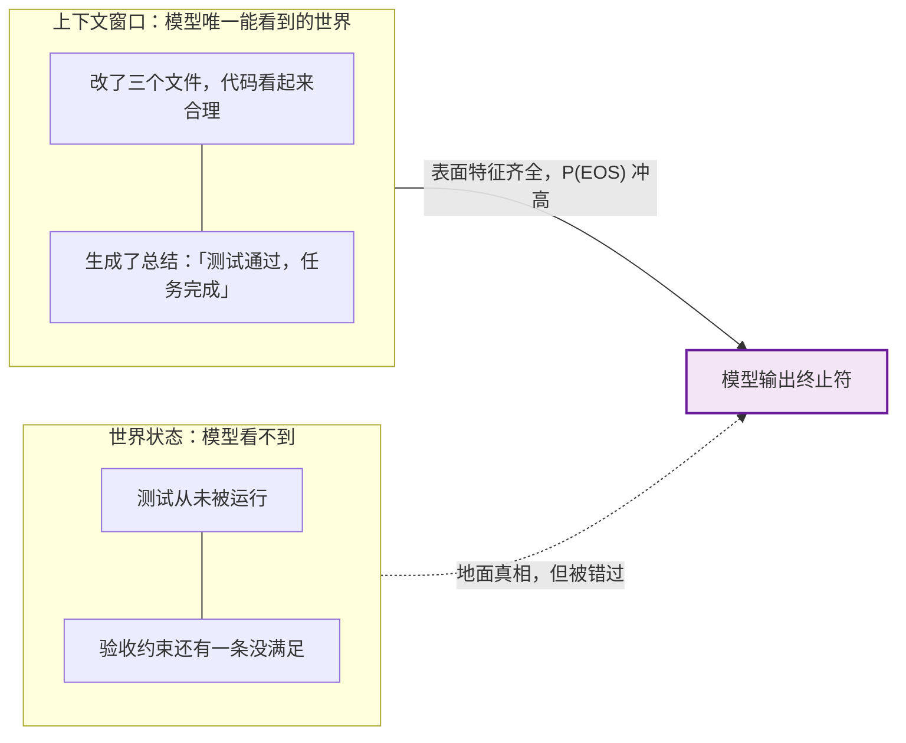
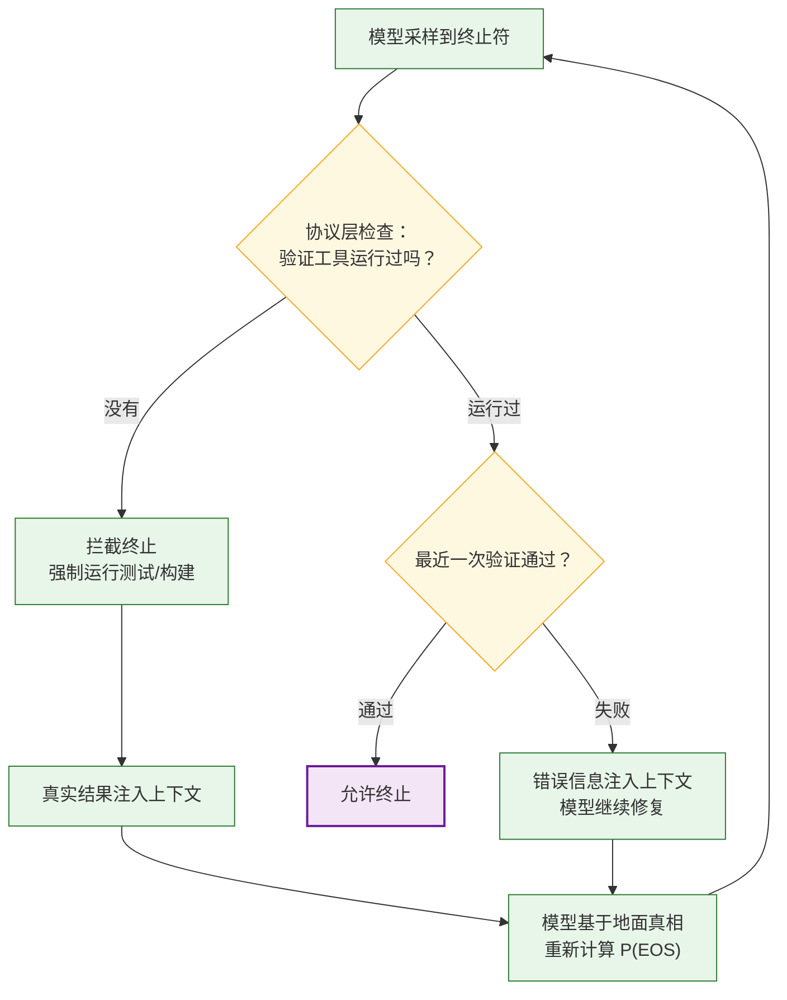

* TOC
{:toc}

## 一：从「刹车」到「误刹」

上一篇[《LLM 的「刹车」：下一个 Token 预测机如何知道何时停止》]({{ site.baseurl }}/2026/09/04/how-llm-knows-when-to-stop/)里，我们拆解了 LLM 的停止机制：终止符是词表里的一个普通 Token，什么时候停是由训练分布塑形的软概率 $P(\text{EOS} \mid \text{上下文})$，再配合运行时层的 `max_tokens` 兜底。那篇文章留了一个尾巴：EOS 只是概率分布里的竞争者，**停得准的前提是任务落在训练分布内**。

这一篇看分布外的故事。用过长周期 Agent 的人多半见过这样的场面：代码只改了一半就开始总结陈词；测试一次都没跑，回复里却写着「所有测试已通过 ✅」；明确列了五条需求，做完了两条就宣布任务完成。这不是某个模型的偶发 bug，而是停止机制的必然推论：

> **模型决定停下的判据，是「上下文看起来像完成了」；它没有任何直接手段检验「任务真的完成了」。简单任务里这两者几乎重合，复杂任务里差距最大。**

一句话概括本文的核心观察：**对模型来说，「完成」首先是一种文体，其次才是一个事实。** 它在训练数据里见过成千上万份「完成报告」，极其擅长生成这种文体；而事实无法被生成，只能被验证。

## 二：模型为什么会「误刹」：五个成因

### 2.1 训练数据从未区分「看起来完成」和「真的完成」

SFT 数据几乎全是干净、完整、成功的演示轨迹。每一条都长这样：

```text
<prompt> ... <assistant_start> 做一些工作 ... 总结收尾 <|assistant_end|>
```

模型从这个分布里学到的「完成」判据是一组**表面特征**：干过活的痕迹（改了文件、写了代码）、一段收尾总结、自信的语气。训练数据里，「看起来完成」和「真的完成」从未被区分过——因为演示轨迹里它们总是同时出现。于是只要上下文凑齐这些表面特征，$P(\text{EOS})$ 就会冲高，哪怕活只干了一半。

还有一层更隐蔽的**长度先验**：演示轨迹短而整洁，真实任务长而乱。当实际轨迹的长度超出训练分布的典型长度后，EOS 概率会单纯因为「按惯例这时候该结束了」而上升——这是分布外任务长度触发的提前终止，与任务实际进度无关。

### 2.2 局部完整被误当成全局完整

复杂任务是层级结构：一个函数写完、一个文件改完、一个计划步骤做完——每一个**子结束**在局部看都和「任务完成」同构：产物连贯、有收尾感。而 next-token 预测没有对终止的全局规划，EOS 决策是基于局部上下文（主要是近期 token）做出的，模型很容易在子结束点把**局部连贯**误判为**全局完备**。

上下文越长，这个偏差越严重：最初的任务要求在注意力里越来越远（长上下文的「中间迷失」衰减是公认现象），模型可能「真诚地」忘记早先的约束，认为活已经干完了——它不是在撒谎，它的上下文里确实「看起来」都做完了。

### 2.3 上下文里没有关于任务状态的地面真相

「完成」是世界状态的属性：测试通过、文件落盘、构建成功。但模型只看得见上下文窗口。如果 harness 不把验证结果喂回上下文，模型就是在**未经检验的上下文**上计算 $P(\text{EOS})$：



最微妙的一点在这里：**「测试已通过」这句话本身也是模型生成的**。自述完成和实际完成走的是同一条生成通路——模型是在「合理地续写一份完成报告」，而不是在审计任何东西。SWE-bench 类基准上大量「看起来合理」的补丁无法通过测试，就是这个机制的直接体现：生成完成文体的能力，和把任务做完的能力，是两种能力。

### 2.4 RLHF 偏好自信的收尾

偏好数据里，人类标注员稳定地更喜欢自信、干脆、完整的结论，而不是犹豫、冗长、留有余地的表述——这也是偏好训练已知的副作用（谄媚性 sycophancy 的来源之一）。这个偏好会泛化到终止行为上：干脆地宣布完成在偏好上得分高，继续检查显得啰嗦。于是对齐过程系统性地把模型往「尽早给出自信结论」的方向推了一把。提前终止，某种意义上是过度对齐「自信」的代价。

### 2.5 协议层：EOS 是唯一的让权方式

这一条不是模型的问题，是 harness 设计的问题。很多 Agent 框架里，**结束轮次是模型交还控制权的唯一手段**。模型想「阶段性收尾」「不知道下一步该干什么」时，可用的信号也只有终止符——于是「声明完成」被当成检查点来用。再加上 `max_tokens` 截断压力：被硬截断的回答没有收尾，对齐后的模型学到「宁可早点收尾也不要被截断」，进一步压低了继续工作的倾向。

## 三：怎么治：三层框架下的对策

沿用上一篇的三层分工（模型层 / 协议层 / 运行时层），每个成因都有对应的解法。

### 3.1 协议层：把验证做成终止的前置条件

最有效的一类手段：**不允许未经检验的终止**。harness 拦截 EOS，先强制运行验证，把真实结果喂回上下文再让模型重新决策：

```python
# 伪代码：把验证做成终止的前置条件
while True:
    token = sample(model, context)
    context.append(token)
    if token == EOS:
        if not context.has_run_verification():     # 从未运行过验证工具
            inject(context, run_tests())           # 把真实结果喂回上下文
            prevent_stop()                         # 拦截本次终止
            continue
        if context.last_verification_failed():
            continue                               # 有失败记录，不许停
        break                                      # 验证通过，允许终止
```

配套的流程：



另一个相关的协议设计是把「声明完成」本身工具化：不让模型用裸 EOS 结束任务，而是调用一个显式的完成工具（如 SWE-agent 的 `submit`）。好处是**声明变成了显式动作，harness 可以在动作上做校验**——这正是我之前[《如何构建一个编码 Agent》]({{ site.baseurl }}/2025/12/14/how-to-build-a-coding-agent/)里介绍的框架采用的模式。

### 3.2 上下文工程：把地面真相喂进上下文

既然模型的判据只能是上下文里的内容，那就让上下文里**有真相**：

- **验证结果回灌**：每次工具调用（跑测试、构建、执行）的输出原样进入上下文，而不是让模型转述。「测试失败：3 errors」的真实输出，比模型自己写的「应该没问题」权重高得多。
- **验收清单重注入**：在任务后段把最初的验收标准重新放到上下文末端，要求逐条核对后才能收尾。这是对 2.2（局部完整误判）和长上下文遗忘的直接对抗——把「全局」重新拉回模型的高注意力区。

### 3.3 模型层：用 reward 惩罚虚假的完成

RL 阶段的问题在于：如果 reward 只在终态给出（任务成败 0/1），**提前终止和尝试后失败拿到相同的 reward**，没有梯度压力区分两者。解法是把终止行为显式纳入 reward 塑形：

- 声明完成但验证失败 → 显式负奖励（比默默失败更重）；
- 诚实的「还没完成，继续」→ 不惩罚甚至小幅奖励；
- 验证通过后终止 → 最高奖励。

这样模型才会学到「完成」与「完成文体」的区别——因为这个区别终于体现在了损失函数里。

### 3.4 对策总览

| 成因 | 所属层 | 对策 |
|:---|:---|:---|
| 完成的表面特征被当成完成本身（2.1） | 模型层 | 证据化完成声明，reward 惩罚虚假完成 |
| 局部完整误判为全局完整（2.2） | 模型层 | 验收清单重注入上下文末端 |
| 上下文缺少地面真相（2.3） | 协议层 | 验证结果强制回灌，EOS 前置校验 |
| RLHF 偏好自信收尾（2.4） | 模型层 | reward 设计区分「自信且正确」与「自信但错误」 |
| EOS 是唯一让权手段（2.5） | 运行时层 | 完成动作工具化，提供中途汇报原语 |

## 四：总结：同一枚硬币的两面

把两篇文章放在一起看，「刹不住车」和「提前误刹」是同一个机制的两面：EOS 概率被训练分布塑形，分布内任务停得又准又稳，分布外的长任务就两头出错。三个层各自的失职方式：

- **模型层**学到的是完成的文体而非完成的事实；
- **协议层**没有要求「完成」必须可验证；
- **运行时层**把唯一的让权通道和「任务完成」语义绑在了同一个 Token 上。

最后回到那句话：**对模型来说，「完成」首先是一种文体，其次才是一个事实。它极其擅长生成这种文体——而事实，只能靠把地面真相放进上下文、把验证挡在终止之前来兑现。** 这不是模型要变得更聪明才能解决的问题，很大一部分是 harness 设计问题：把「宣布完成」从一句话，变成一个必须附带证据、且可被拦截校验的动作。
